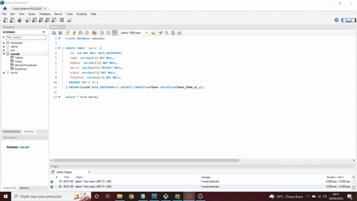
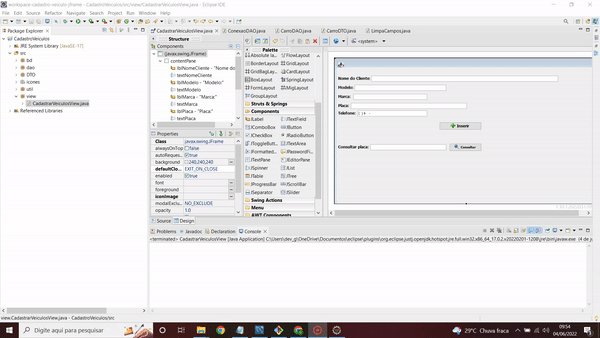

# jframe-cadastro-veiculos<h1 id="nome-do-projeto" align="center">CADASTRO DE VEÍCULOS 🚗</h1>

  - 🤖 [Tecnologias](#tecnologias)
  - 🌍 [Requisições](#requisicoes)
  - ⚓ [Configuração](#config)
    
<h2 id="tecnologias">Apresentação</h2>
 Consultar:
<p align="center">
  
</p>

 Inclusão:
<p align="center">
  
</p>


<h2 id="tecnologias">🤖 Tecnologias/Ferrramentas</h2>

- **JDK**
- **Eclipse**
- **WindowBuilder**
- **MySql**

<br />

<h2 id="requisicoes">💻 Pré-requisitos</h2>

Antes de começar, verifique se você atendeu aos seguintes requisitos:

* JDK 8 (qualquer versão atual)
* Eclipse
* Mysql
## Executando o projeto

```
1. Crie uma pasta chamada workspace-cadastro-veiculo-jframe(o nome pode ser opcional)
2. clone o projeto: git clone https://github.com/Gabriel-developer-01/jframe-cadastro-veiculos.git
2. Importe o projeto na ide(eclipse, IntelliJ, netbeans e etc);
3. execute a classe CadastrarVeiculosView: src > view > CadastrarVeiculosView.java
```

<h2 id="config">⚓ Configuração</h2>
 
1. <a href="https://www.youtube.com/watch?v=fmerTu7dWk8" target="_blank" title="acessar o vídeo"><strong>Instalação e configuração do mysql</strong></a>
2. Ir até a classe "ConexaoDAO": src > bd > ConexaoDAO.java
3. trocar a variável url colocando seu usuario e senha do mysql, no meu caso eu fiz o banco de dados no usuario root, então vc deve colocar o usuario e a senha do mysql nos lugares adequados.

Exemplo:

<h1 style="padding: 100px; background: #333333;">
    
</h1>

> script para criação do banco de dados e tabela.

> caso deseje mudar o nome do banco e tabelas tem que seguir os seguintes passos:
1. Alterar a url para o novo nome do banco de dados: jdbc:mysql://localhost:3306/[nome do banco de dados]?user=[nome do usuario do mysql]&password=[aqui a senha]
2. Nas classes do pacote DAO do projeto terá que mudar nas querys os nomes da tabela antiga(carro) para o novo nome da tabela.

```
create database veiculo;

CREATE TABLE `carro` (
  `id` int NOT NULL AUTO_INCREMENT,
  `nome` varchar(50) NOT NULL,
  `modelo` varchar(10) NOT NULL,
  `marca` varchar(50) DEFAULT NULL,
  `placa` varchar(50) NOT NULL,
  `telefone` varchar(15) NOT NULL,
  PRIMARY KEY (`id`)
) ENGINE=InnoDB AUTO_INCREMENT=22 DEFAULT CHARSET=utf8mb4 COLLATE=utf8mb4_0900_ai_ci;
```

## 🤝 Perfil do dev

<table>
  <tr>
    <td align="center">
      <a href="https://www.linkedin.com/in/gabriel-mendes-3a668917b/">
        <br>
        <sub>
          <b>Gabriel Mendes</b>
        </sub>
      </a>
    </td>
  </tr>
</table>

[⬆ Voltar ao topo](#nome-do-projeto)
